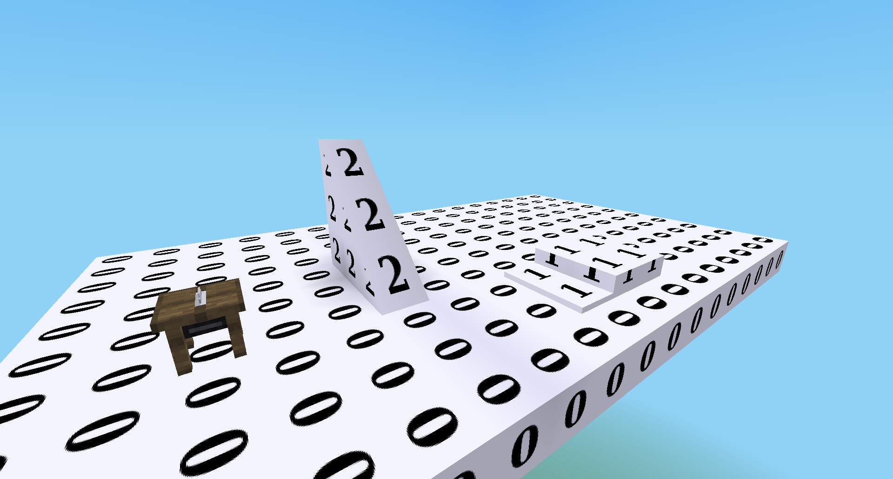

Replacement/placeholder blocks intended for schematics

# Features

* Can be placed in schematics for later replacement with the proper nodes
* moreblocks integration

# License

* Textures: `textures/ehlphabet*` CC-BY-SA-3.0 https://git.bananach.space/ehlphabet.git
* Code: `MIT`